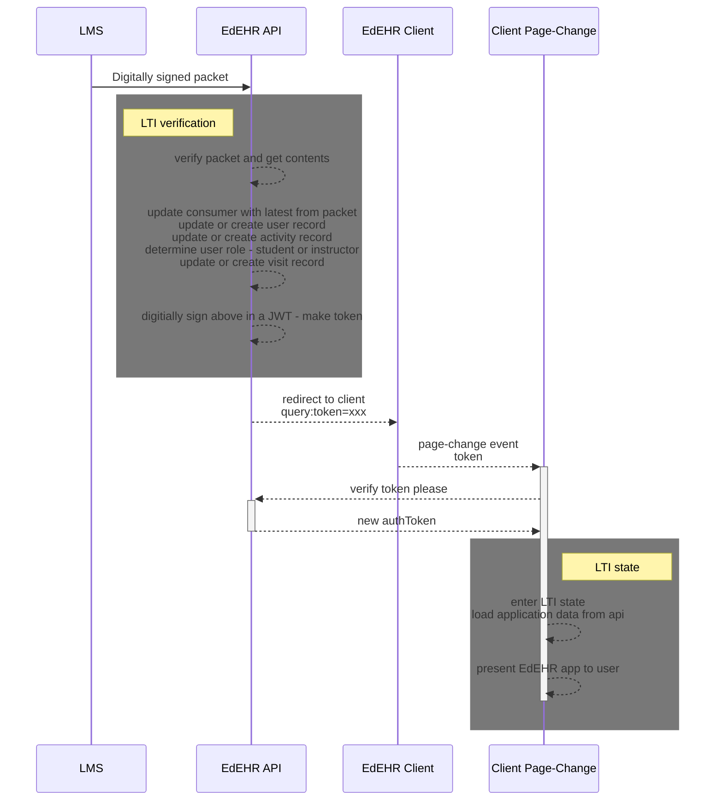
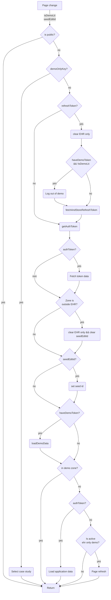
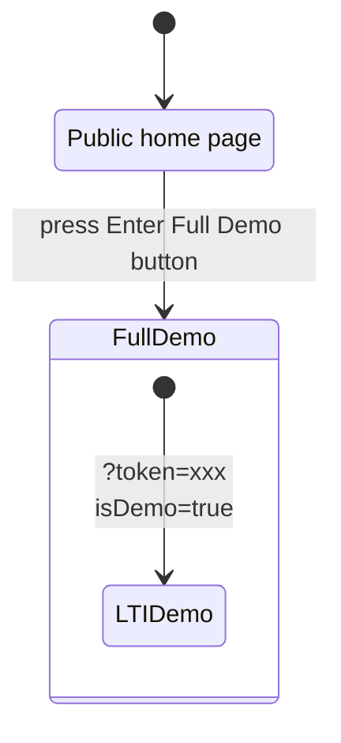
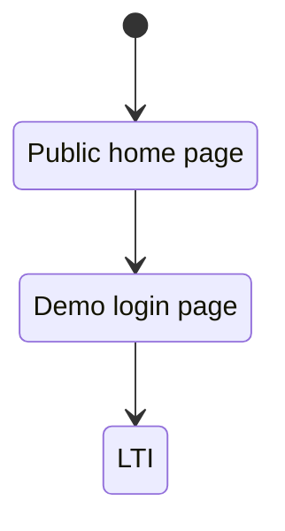
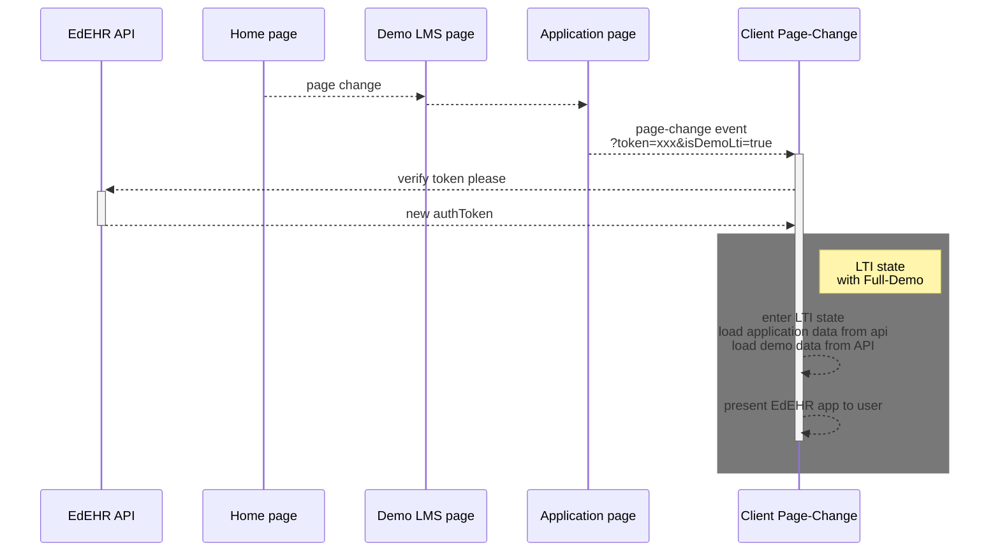
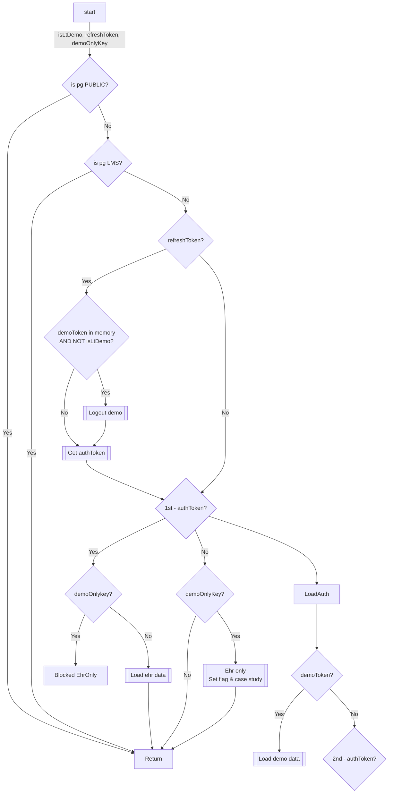

# About the page-controller

There is just one instance of PageController owned by the main.js entry point.  PageController is responsible for the page load event. ```onPageChange``` is invoked from main.js whenever a route has changed.

## States
The EdEHR has many layers of state.

### Stateless pages

Pages with zone PUBLIC need to be accessible all the time. These pages are stateless.

Pages with zone DEMO are stateless. 
   Each page's ```onMount``` handler checks to confirm the user has clicked the full demo button on the home page which creates the demo environment. If not then the user is redirected to the home page.

### LTI 

- EdEHR application pages are in the LTI state
- Users always arrive via an LTI call from an LMS.
- The LMS makes an LTI post to an EdEHR server. 
- If the post message is valid the server redirects to the client side with a ```token``` in the query string. 
- The client sends this token to the as-configured api server for validation. (The prevents spoofing the client with any old token). 
- The server responds with the authentication token.




At this point the user is inside the LTI state.
The LTI state has two sub-states that can exist at the same time: Full-Demo and SeedEditing




https://mermaid.live/edit#pako:eNp1VNtu2kAQ_ZXpPkSORKJwT1GVysmCiIpIBH6pSx823gFbgV1kr6MSw793L3bAtOEJn5k5Z-bM7hYkkhzJgKxSto0hoAsB-uf_emYrhChmYoW_4erqDvZJRnEjJyqBby_pHWSIfMgT9cj3cF8kGWzzl3USfT84hntXtMNsDzNUeSpquJB7eCi4JnwS690P3FV1Dybuyqg3xzVGCiKWIWQq57tLl0QtySmtKzOswyLFZYpZHMhXFBXt8CjrByeQUxp50RpZCsPxDKTup5QZ2SJKi5i9oRneUrrxLy7gy4cjpQilJ0NPqDeRK5C5ArkEM2nJOnFZo6BeZFobBd4SVRT7gs-VTNHPlRujaiiwuX7grVCdB30XHAcFqyLV9OPgpLER9UZGBJSdhjPFLutpQoo9TMNhKeoa1N9FKAWCXrV1QE-WJRyNaZWOzjld-zQ889W45pDj6bk8KzU-zOePDtUUFtVAcSyp5DR6rBnT4Ay1TeivuZehsoqQVHIGdnbRoL7eD89oUNsm9daScZNGj45Nyu3R8KzIdETDIhF28_CujauIafjJ1agC7pD-Z40aPG3JNyeMcWDbrb54TCWyts2PbHsrnqaTn8VjBixSyRuaBWKcuqWYDisJTfrP3bK1R6pPQran55lnH47yCpadPM9qnKRBNphuWML1u1OYlAVRMW5wQQb6L2fp64IsxEHnaQvkfCciMlBpjg2Sb_WASBOmn6sNGSzZOtPolgkyKMgfMmi129edm07na6vfa7e6zXaD7DTavb1u95r9m-5tv3nTb_YPDfIupSZoXndv2z0d6vV73W6v1WlZttAGjeThL66pjPM

#### Full-demo 
- The LTI entry query contains the ```isDemoLti=true``` flag along with the initial refresh token.
- The state is determined by the presence of the ```demoToken``` in browser memory.
- Full-Demo acts just like LTI-Normal except it loads demo related data.
- Note that this state also has ``authToken`` in browser memory.
- The Demo Access component prevents the user from activating this state if any LTI state is active.
- If state is LTI-Full-Demo then the Demo Access component lets the user return to the full demo.

Full-Demo flow





Demo token validation


- If LTI + Full-Demo is active when a new LTI entry happens then the application logs the user out of Full-Demo (removes both in memory and on server data).

#### Seed-Editing
The query may contain the ```seedEditId=<id>``` id.  This comes after the instructor user has entered LTI and wishes to edit a case study in the EHR.


## EHR DEMO
Newly introduced is a EHR ONLY demo mode. The initial call comes with 'demoOnlyKey' which indicates which case study to use.

LTI, EHR_ONLY all are stateful. The user needs to navigate around these areas and remain in the state, even after a page refresh.

The application current uses localStorage to maintain state.
> TODO consider using sessionStorage

On entry to any of the stateful areas the application stores some data in the browser's memory.  On any page change this data is used to identify the state and make appropriate api calls.


```js
    const { meta: routeMeta, name: routeName, query: routeQuery } = route
    const { zone: routeZone } = routeMeta
    const {
      isDemoLti,
      demoOnlyKey,
      seedEditId,
      token: refreshToken
    } = routeQuery
```

## All zones 

1. Use the route metadata to set the page title and icon.
2. Make a call to the api to load information from the api server
   1. includes the site name which is used to set the name that appears in the window tab
   2. for more information see the homeRoute handler in the server api.js file.

## Public zone 

Entry Condition: the route metadata is public

Action: do nothing

## LMS state

Entry Condition: the route metadata is lms

Action: do nothing and let the lms pages handle state checks

## LTI  and LTI-DEMO

Entry Conditions for LTI:  Either 
1. the query string contains the refreshToken ```(token=xxx)``` and does not contain 'isDemoLti'  OR
2. local storage has an authToken in memory.

Entry Conditions for LTI-DEMO :  Either
1. the query string contains the refreshToken and does contain 'isDemoLti'  OR
2. local storage has a demoToken in memory (it also has an authToken)

Actions: 
1. If query string contains refreshToken
   1. If demoToken exists AND the query string does not contain isDemoLti then
      1. TODO prompt user that their full demo is about to be reset
      2. clear the local and server side memory of all demo data (e.g. log user out and remove all data)
   2. Send the refreshToken back to the API server.  This loads the authToken into memory.
2. If the demoToken exists then call the API, with auth header containing authToken and with the demoToken to get demonstration data.
3. If the authToken exists (only if set by step 1.i. above) then 
   1. perform the required API loading calls. See the code for this.  
   2. Ends with invoking the page data refresh event.
   3. Also clear the ```EhrOnlyDemo.isActiveEhrOnlyDemo()``` flag

Note how step 2 and 3 work whether the user has just arrived with a refreshToken, or is later navigating around the EdEHR application or if they just did a browser refresh.

Note how LTI takes precedence over LTI-DEMO.

Note, from below, how either LTI takes precedence over EHR ONLY

## EHR_ONLY

Note how the LTI or LTI-DEMO state can be determined by the presence of the authToken.

Entry Conditions: Either:
1. If the query string contains demoOnlyKey OR
2. EhrOnlyDemo.isActiveEhrOnlyDemo() is true

Note that EhrOnlyDemo.isActiveEhrOnlyDemo() does not survive a page refresh.

Actions:
> TODO Build step one
1. If state is LTI or LTI-DEMO then redirect some place and stop here
2. Set the globally stored demo is active flag. Then code uses ```EhrOnlyDemo.isActiveEhrOnlyDemo()``` to take demo only actions.
3. Use the value associated with the 'demoOnlyKey' to select the case study.
4. Invoke the page data refresh event


